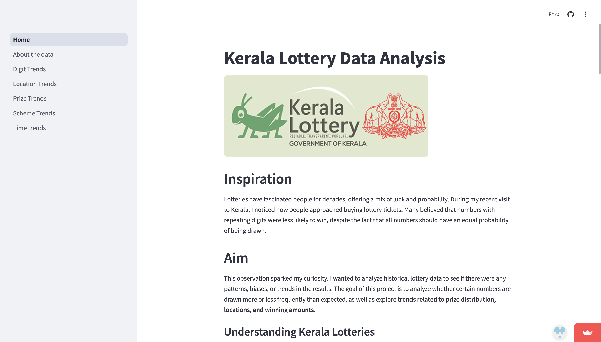
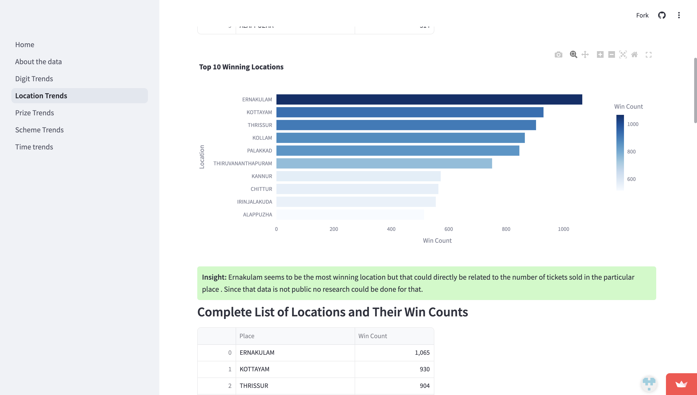
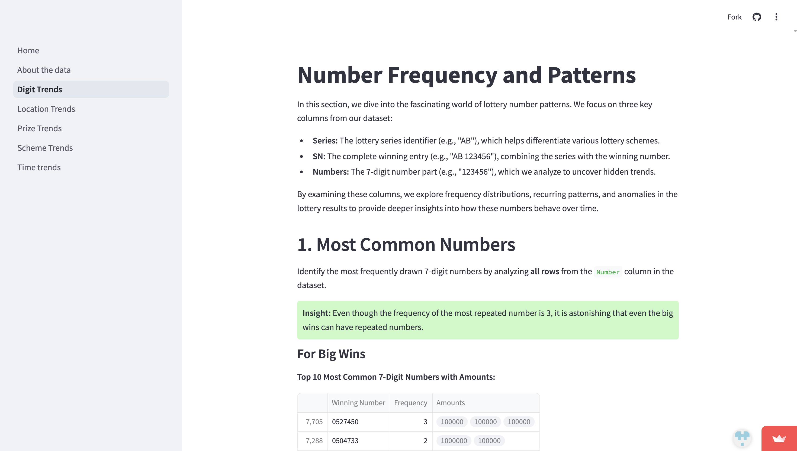
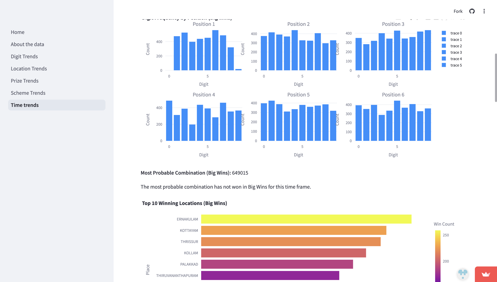
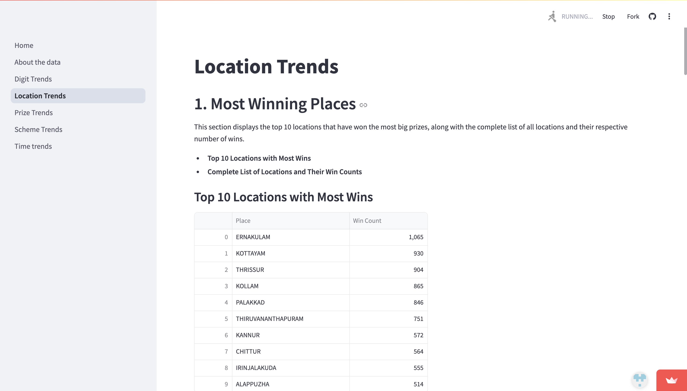

# 🎯 Kerala State Lottery Result

Lotteries have long captured the imagination of people, blending chance, hope, and strategy. During a recent visit to Kerala, I was intrigued by how locals approached buying lottery. This anecdotal observation led me to ask a bigger question: Are certain numbers actually less likely to be drawn, or is it all just perception?

This project dives deep into Kerala lottery data, analyzing thousands of past results to uncover possible patterns, biases, or trends. By examining aspects such as number frequency, prize distribution, winning locations, and the impact of digit repetition, the goal is to bring data-driven insight to what many view as pure luck.

🔗 **Check out the live app here:** [Kerala Lottery Result Analysis](https://keralalotteryresult.streamlit.app/)

---

## 🔍 Features

This project offers a deep-dive analysis into Kerala State Lottery results using a robust dataset scraped from official government PDFs. Key features include:

- **📥 Automated Data Collection**  
  Scraped over **1000+ PDFs** from the [Kerala Lotteries Official Website](https://statelottery.kerala.gov.in/English/) for results between **March 2021 and August 2023**.

- **🛠️ Custom Scraping Scripts**  
  Scripts for downloading and parsing PDFs are included in the repo and freely available for reuse or modification.

- **🧼 Data Cleaning & Structuring**  
  Extracted draw date, scheme name, serial number, ticket number, location, and prize amount from each PDF and structured them into clean, analyzable datasets.

- **📊 Two Comprehensive Datasets**  
  - **Big Wins** – Full match of series and 6-digit number  
  - **Small Wins** – Match of last four digits only  

- **📁 Kaggle Dataset Available**  
  Full datasets with descriptions are also hosted on Kaggle for further exploration:  
  👉 [Kerala Lottery Dataset on Kaggle](https://www.kaggle.com/datasets/alanksijo/kerala-lottery-result)

- **📈 Multiple Trend Analyses**  
  Includes trends based on:
  - Winning digit patterns
  - Prize distribution
  - Ticket location data
  - Scheme-specific behavior
  - Time-based frequency shifts (weekly/monthly)

## 🧪 Tech Stack

### 🔧 Core Technologies

- **`Python`** **`Streamlit`** 

---

#### 📊 Data Handling & Analysis
- **`pandas`** **`numpy`** **`pyarrow`** 

#### 📈 Data Visualization
- **`matplotlib`**, **`seaborn`** **`plotly`** **`altair`**  **`pydeck`** 

#### 📑 PDF Processing
- **`pypdf`**

---

📌 **Note**: You can find the full list of dependencies in the `requirements.txt` file in this repository.

---

## 🙏 Acknowledgements

This project would not have been possible without the publicly available data provided by the **Kerala State Lotteries**.

> **Kerala State Lotteries** is a lottery programme run by the [Government of Kerala](https://kerala.gov.in/), established in **1967** under the **Lottery Department**. It is India's **first government-run lottery system**, and has since been recognized for its **transparency**, **efficiency**, and **social impact**.

I gratefully acknowledge the official website of the Kerala State Lotteries:  
🔗 [https://statelottery.kerala.gov.in/English/](https://statelottery.kerala.gov.in/English/)  
as the **primary source** for all the data used in this analysis.

This work is an independent academic and analytical effort. All data belongs to the Kerala State Lotteries and the Government of Kerala.

---

---

## 📸 Screenshots

Here are some visuals from the project interface and analysis:

| 📊 Dashboard | 📍 Location Trends |
|--------------|--------------------|
|  |  |

| 🔢 Digit Trends | 🕒 Time-Based Patterns |
|----------------|------------------------|
|  |  |

| 💰 Prize Distribution |
|------------------------|
|  |

---
